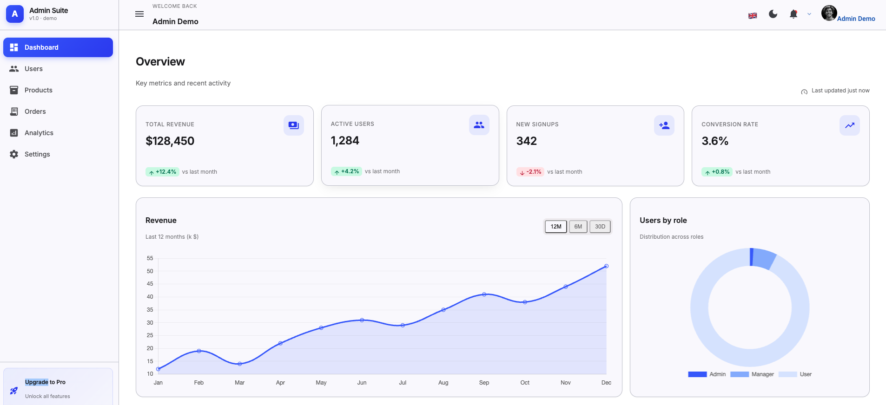
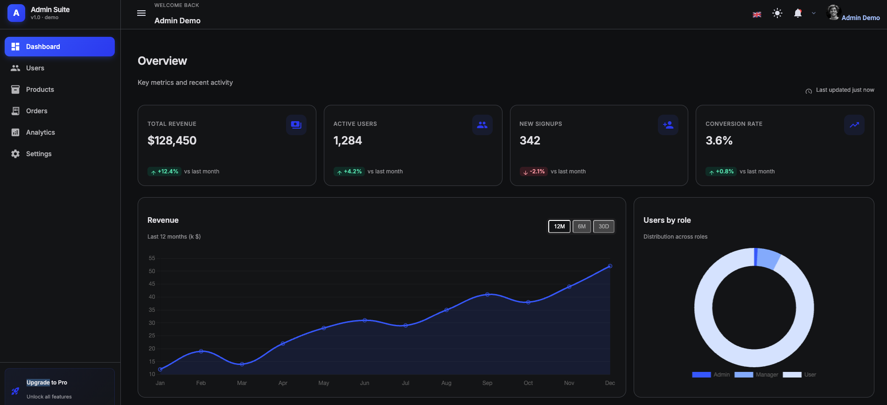
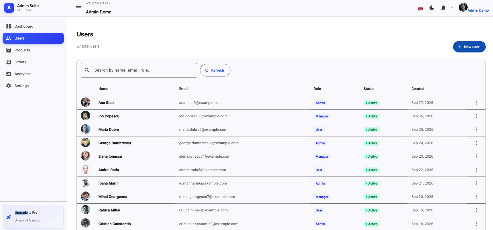
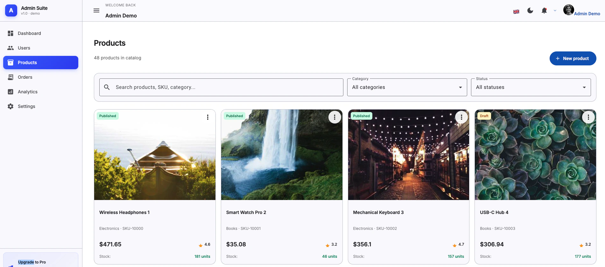
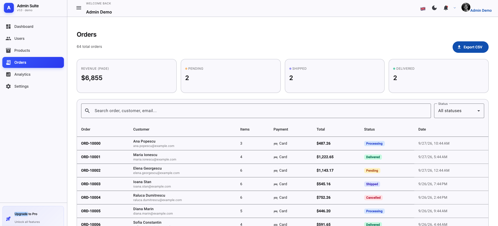
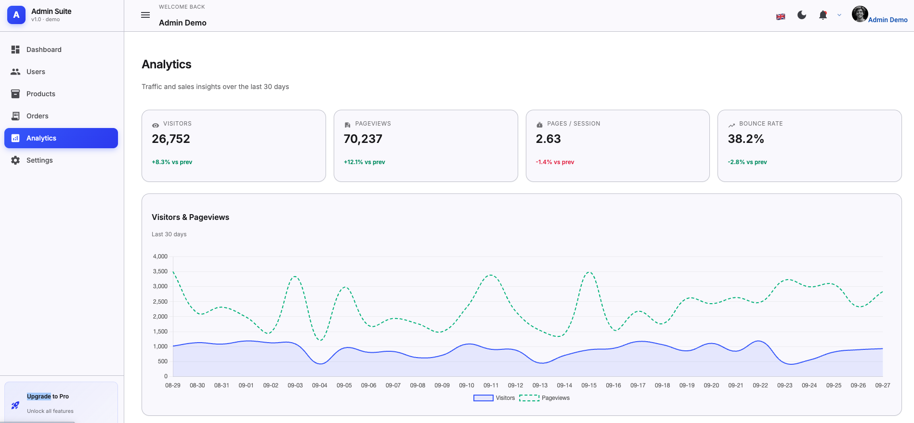
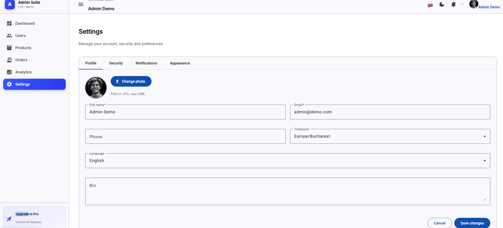

# Admin Dashboard

Angular 21 admin dashboard — standalone components, signals, zoneless change detection, and a self-contained mock backend so the whole thing runs with a single `npm start`.

> **Live demo:** <https://vitaliecondorache.github.io/admin-dashboard/> · **Demo credentials:** `admin@demo.com` / `admin123`

[](https://vitaliecondorache.github.io/admin-dashboard/)
[](https://github.com/VitalieCondorache/admin-dashboard/actions/workflows/ci.yml)
[](https://github.com/VitalieCondorache/admin-dashboard/actions/workflows/deploy-pages.yml)


## Screenshots



<table>
  <tr>
    <td width="50%"><br><em>Dashboard — dark theme</em></td>
    <td width="50%"><br><em>Users — paginated, sortable CRUD table backed by the Signal Store</em></td>
  </tr>
  <tr>
    <td width="50%"><br><em>Products — filterable grid (search, category, status)</em></td>
    <td width="50%"><br><em>Orders — summary cards plus debounced search and status filter</em></td>
  </tr>
  <tr>
    <td width="50%"><br><em>Analytics — multi-series traffic chart</em></td>
    <td width="50%"><br><em>Settings — profile / security / notifications / appearance</em></td>
  </tr>
</table>

## Highlights

- **Modern Angular** — standalone components, signals, `inject()`, functional guards & interceptors, zoneless-ready.
- **Strict TypeScript** — `strict`, `strictTemplates`, `noImplicitReturns`, `noPropertyAccessFromIndexSignature`.
- **State management** — `@ngrx/signals` Signal Store (see [`UsersStore`](src/app/features/users/users.store.ts)) with computed selectors and `rxMethod`-driven async flows.
- **Self-contained** — an HTTP interceptor ([`mockApiInterceptor`](src/app/core/mock/mock-api.interceptor.ts)) serves the entire `/api/*` surface from in-memory seed data with realistic latency, pagination, sorting and search.
- **i18n** — Transloco with English + Romanian, runtime language switching, 198 keys per language (full parity).
- **Theming** — class-based dark mode, system-aware, persisted across reloads.
- **Tested** — Vitest unit suite covering services, guards, interceptors, the signal store, dialogs and feature components (~93% statements / ~96% lines).
- **CI** — GitHub Actions workflow runs lint, tests and a production build on every push and PR.

## Stack

| Concern   | Choice                                     |
| --------- | ------------------------------------------ |
| Framework | Angular 21 (standalone, signals, zoneless) |
| State     | `@ngrx/signals` (Signal Store)             |
| UI        | Angular Material + TailwindCSS 3           |
| Charts    | Chart.js via `ng2-charts`                  |
| Forms     | Reactive Forms                             |
| HTTP      | `HttpClient` + functional interceptors     |
| Routing   | Standalone routes + lazy loading           |
| i18n      | `@jsverse/transloco`                       |
| Tests     | Vitest + `@vitest/coverage-v8` + jsdom     |
| Tooling   | ESLint, Prettier, EditorConfig             |

## Architecture

```
src/app/
├── core/           # cross-cutting: auth, http, i18n, mock API, services, models
│   ├── auth/       # AuthService (signals) + auth/guest/role guards
│   ├── http/       # auth + error interceptors
│   ├── i18n/       # Transloco loader + LanguageService
│   ├── mock/       # in-memory HTTP interceptor + seed data
│   ├── models/     # domain types
│   └── services/   # ThemeService
├── shared/ui/      # presentational primitives (ConfirmDialog, Placeholder)
├── layouts/        # DashboardLayout (sidebar + topbar shell)
└── features/       # pages, all lazily loaded via loadComponent
    ├── auth/       # login (Reactive Forms)
    ├── dashboard/  # KPI cards + charts + recent orders
    ├── users/      # CRUD with NgRx Signal Store + MatTable
    ├── products/   # filterable grid
    ├── orders/     # table with summary cards
    ├── analytics/  # multi-chart page
    └── settings/   # tabbed settings (profile / security / notifications / appearance)
```

The interceptor pipeline is wired in [`app.config.ts`](src/app/app.config.ts) as `[authInterceptor, errorInterceptor, mockApiInterceptor]` — the order matters: auth attaches the token first, the error handler wraps everything, and the mock runs last so real auth/error logic sits on top of the synthetic responses.

## Getting started

Requires Node `^20.19.0 || ^22.12.0 || >=24.0.0` — the range Angular 21 declares (`engines` in [`package.json`](package.json)). A CI-matching version is pinned in [`.nvmrc`](.nvmrc), so `nvm use` is enough.

```bash
npm install
npm start
```

Open <http://localhost:4200>. The app boots straight into the login page — sign in with the demo credentials above. No backend required.

### Available scripts

| Command                 | What it does                                 |
| ----------------------- | -------------------------------------------- |
| `npm start`             | Dev server on port 4200 with live reload     |
| `npm run build`         | Production build (output in `dist/`)         |
| `npm run build:pages`   | Production build with the Pages base href    |
| `npm test`              | Vitest unit suite                            |
| `npm run test:coverage` | Vitest with V8 coverage report (`coverage/`) |
| `npm run lint`          | ESLint over `src/`                           |
| `npm run format`        | Prettier write across the workspace          |

### Environment

The app talks to `/api`, which is intercepted by the mock layer. To point at a real backend later, copy `.env.example` to `.env` and override `NG_APP_API_BASE_URL`.

### Deployment

The app is published to GitHub Pages by [`.github/workflows/deploy-pages.yml`](.github/workflows/deploy-pages.yml) on every push to `main`:

**<https://vitaliecondorache.github.io/admin-dashboard/>**

Because the mock layer answers `/api/*` inside the browser, a static host is all this project needs — no server, no database. Two details make the sub-path deploy work:

- **`--base-href /admin-dashboard/`** — project pages are served from `/<repo>/`, so the build is made with a matching base href (also available locally as `npm run build:pages`). Every runtime asset path is relative, so the same code still works at `/` during `npm start`. If you rename the repository, deploy at a domain root, or attach a custom domain, update that value in the workflow and in the `build:pages` script.
- **`404.html`** — Pages has no rewrite rules, so hitting `/admin-dashboard/users` directly would 404. The workflow copies the built `index.html` to `404.html`, which boots the app shell and lets the client-side router resolve the deep link.

> Pages is off by default on a fresh repository — enabling it once under **Settings → Pages → Build and deployment → Source: GitHub Actions** is all it takes. It is already enabled for this repository, so a fork only needs that one setting.

## Project structure quick map

- **Routing:** [`src/app/app.routes.ts`](src/app/app.routes.ts) — every feature is lazy-loaded.
- **Auth flow:** [`AuthService`](src/app/core/auth/auth.service.ts) + [`auth.guards.ts`](src/app/core/auth/auth.guards.ts) + [`auth.interceptor.ts`](src/app/core/http/auth.interceptor.ts).
- **Mock API:** [`mock-api.interceptor.ts`](src/app/core/mock/mock-api.interceptor.ts) covers auth, paginated `/api/users`, products, orders, analytics and dashboard stats. Seed data lives in [`seed.ts`](src/app/core/mock/seed.ts).
- **State example:** [`features/users/users.store.ts`](src/app/features/users/users.store.ts) is the canonical example of a Signal Store + `rxMethod` CRUD flow.
- **Tests:** colocated `.spec.ts` files. See [`features/users/users.component.spec.ts`](src/app/features/users/users.component.spec.ts) for a representative integration-style test. Shared test helpers live in [`src/testing/`](src/testing/transloco-testing.ts) — `provideTranslocoTesting()` supplies a stub Transloco loader that any spec rendering the `transloco` pipe needs.

A longer architectural walkthrough lives in [docs/ONBOARDING.md](docs/ONBOARDING.md).

## Development notes

- The repository sets `legacy-peer-deps=true` in [`.npmrc`](.npmrc), so a plain `npm install` is enough — no extra CLI flags. Some Material 21 packages still publish loose peer ranges.
- Signals + zoneless mean change detection runs only when a signal changes or an event fires — avoid pushing imperative state into components; reach for a signal or a Signal Store method instead.
- All user-facing strings go through Transloco. Add new keys to both [`en.json`](public/assets/i18n/en.json) and [`ro.json`](public/assets/i18n/ro.json).

## Roadmap

Future improvements I’d like to explore:

- Playwright E2E suite covering login → CRUD → logout.
- Server-side rendering with Angular Universal.
- Real backend swap-in (NestJS) replacing the mock interceptor.
- More analytics widgets (cohort retention, funnel breakdown).

## License

[MIT](LICENSE)
